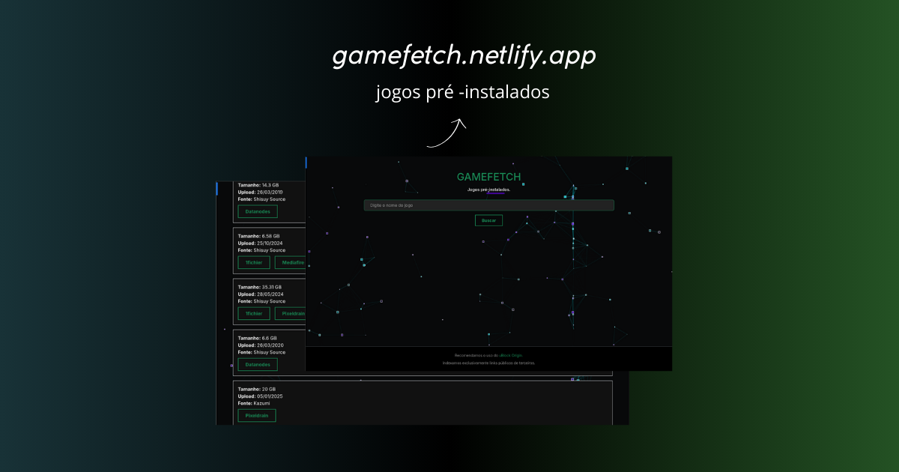

<h2 style="display: flex; align-items: center; gap: 8px;">
  
  Demo
</h2>

  

 

> [!WARNING]
> O site agrega fontes externas com autoria de terceiros.

> [!TIP]
> É recomendável o uso do [uBlock Origin](https://ublockorigin.com/).

<h2 style="display: flex; align-items: center; gap: 8px;">
  
  Creditos
</h2>

- [Hydra Library](https://library.hydra.wiki/library)
- [Bootstrap](https://getbootstrap.com/)
- [Particles](https://vincentgarreau.com/particles.js/)
- [favicon.io](https://favicon.io/)
